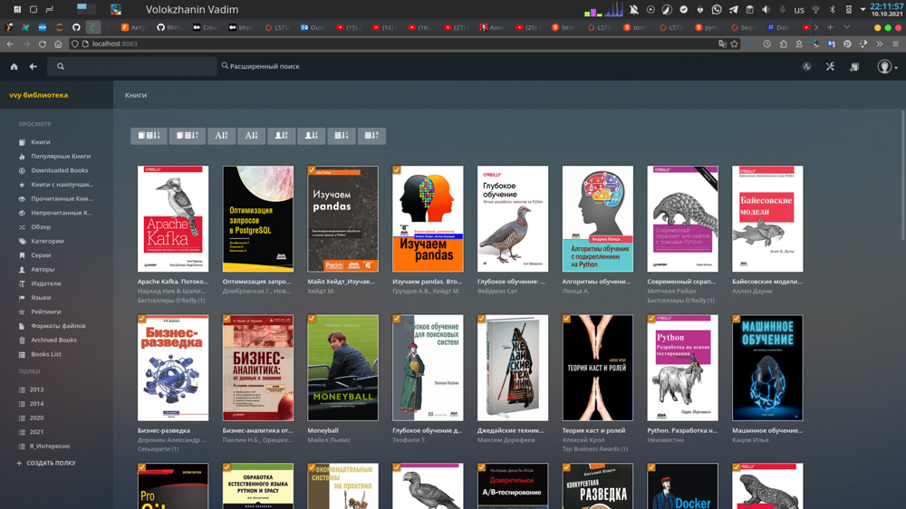

# Calibre - my private library


## Server install
1. Install on pc calibre (Arch linux): `sudo pacman -S calibre`.
1. Move `metadata.db` in necessary path where our books will be located. Database can be no access, execute (Arch linux): `sudo chmod 777 ./metadata.db` и перезапускаем Docker.
1. Uninstall calibre from pc: `sudo pacman -R calibre`.
1. In user interface select path (see point 2).
1. Change user and user password, add possibility for load books.
1. Write ports on your router
1. Backup via `crontab -e`: `18 13 * * * /mnt/0/documents/projects/pc_settings/calibre/calibre_backup.sh`.
1. For external data base use [goodreads](https://www.goodreads.com).

## Smartfon install


Install [Moon+ Reader (Android)](https://play.google.com/store/apps/details?id=com.flyersoft.moonreader&hl=ru&gl=US)

### FAQ
* Change password:
```
# Enter in container
docker exec -it calibre-web bash
# Change password
cd /app/calibre-web
python3 cps.py -s admin:admin123
```
For backub use [private_library_backup.sh](./private_library_backup.sh) and [dag airflow](https://github.com/VolokzhaninVadim/airflow/blob/main/dags/backup_s3.py).

## Links
1. [Calibre docker image](https://docs.linuxserver.io/images/docker-calibre-web).
1. [Calibre github](https://github.com/janeczku/calibre-web).
1. [Readar docker image](https://hub.docker.com/r/hotio/readarr)
1. [Readar github](https://github.com/hotio/readarr)
