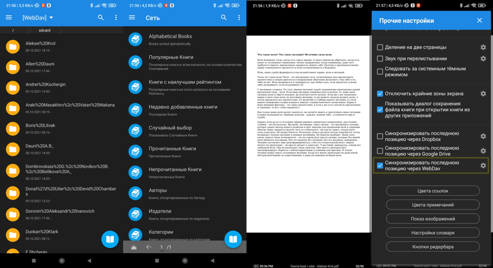

# Calibre - личная библиотека

## Порядок установки на сервер: 
1. Устанавливаем на пк calibre: `sudo pacman -S calibre`.
1. Перемещаем `metadata.db` в необходимую папку, где будут лежать книги на сервере. БД может быть не доступна для записи, выполняем: `sudo chmod 777 ./metadata.db` и перезапускаем Docker. 
1. Удаляем с пк calibre: `sudo pacman -R calibre`.
1. В интерфейсе выбираем этот путь (см. п.2). 
1. Изменяем пароль, тему, добавляем возможность загрузки книг. 
1. Пробрасываем на роутере порты. 
1. Доступ внутрь контейнера: `docker exec -it calibre-web bash `. 
1. Backup делаем через `crontab -e`: `18 13 * * * /mnt/0/documents/projects/pc_settings/calibre/calibre_backup.sh`. 

## Порядок установки на смартфон: 
1. На смартфон устанавливаем [Moon+](https://play.google.com/store/apps/details?id=com.flyersoft.moonreader&hl=ru&gl=US). Прописываем [WebDAV](https://ru.wikipedia.org/wiki/WebDAV) и calibre ip. [WebDAV](https://ru.wikipedia.org/wiki/WebDAV) - обеспечиваем доступ через [nextcloud](https://github.com/VolokzhaninVadim/nextcloud) (личный репозиторий).
1. Чтобы после закрытия книги была возможность вернуться на прежнюю страницу проставляем чек-бокс "Синхронизировать последнюю позицию через WebDav" (см. ниже). 

## Ссылки 
1. [Образ](https://docs.linuxserver.io/images/docker-calibre-web).
1. [github](https://github.com/janeczku/calibre-web).
